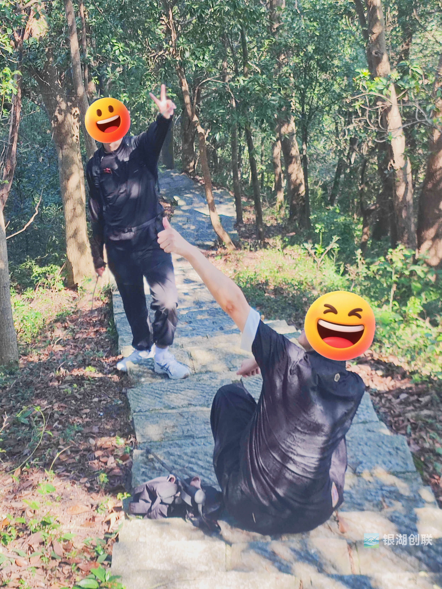
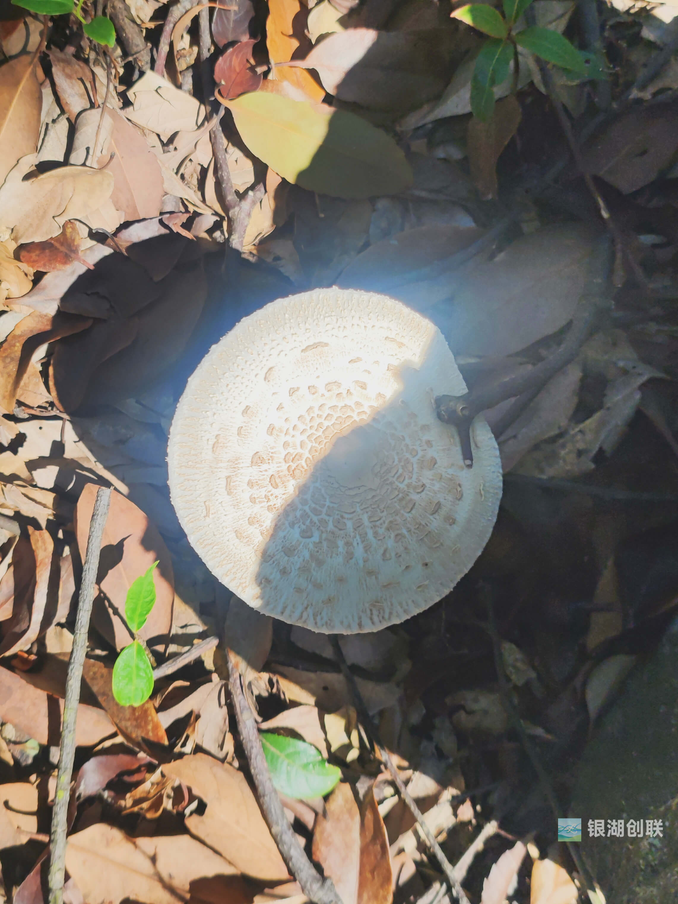
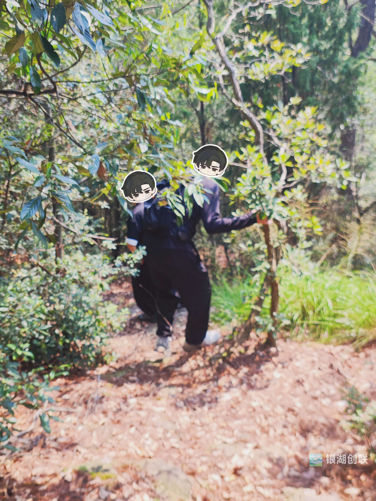
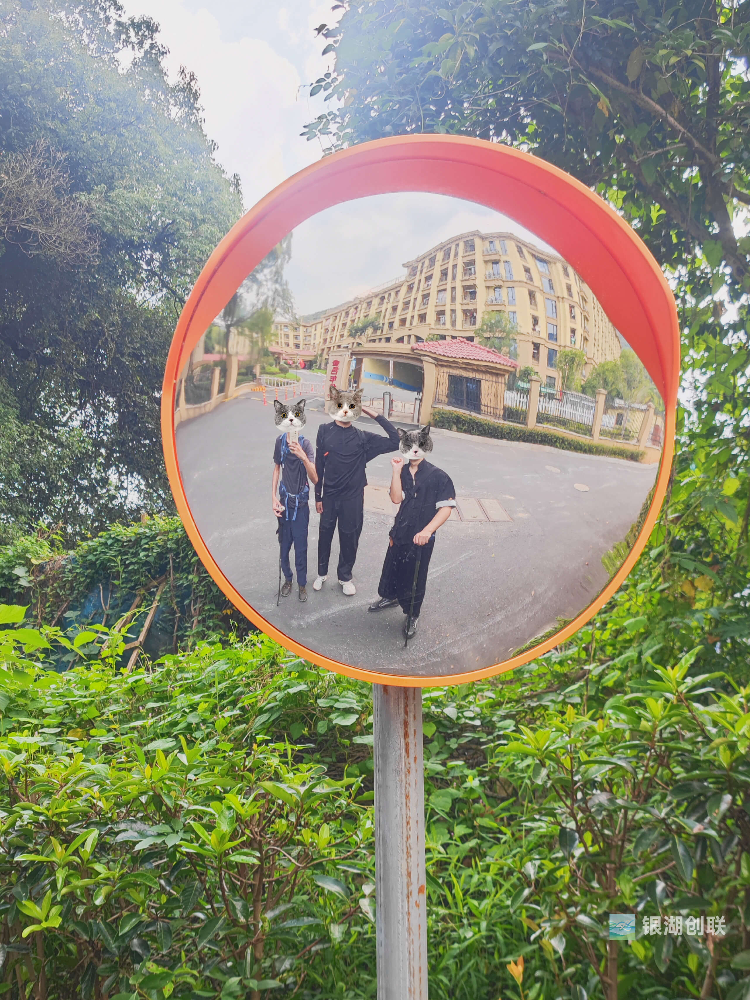

如果要用一个词总结银湖创联的第三次徒步，那大概是——「水逆」。

但奇妙的是，当我们在金家岭山脚的金色年华退休社区门口，互相看着对方满身的尘埃、擦伤的手臂和依然兴奋的眼神时，所有人都笑了。

这场原计划探索大洋坞水库南侧新环线的「探路之旅」，最终变成了一堂生动的山野安全实践课。

**出发即考验，水逆三连击**

故事的开始就充满了戏剧性。

我开车接第一位同伴时，车辆突然报了电子驻车故障，彻底趴窝。

正当我们面面相觑时，另一位同伴恰巧驾车路过——这缘分，不一起去爬山都对不起老天的安排！

天气炎热，阳光炙烤着登山步道。

一位同伴在类似上次的位置再次感到不适，我们立刻休息，并递上一颗咖啡糖补充能量。

事后我们调侃：这大概是本次徒步中最「常规」的一个小插曲了。

**野路前的馈赠：蘑菇、灵芝与「龙族」**

因为是工作日，山中格外幽静。

行至鉴远亭，偶遇一支近十人的队伍，互相打过招呼后，我们便继续南行，进入了更原生态的路径。

这里的生态丰富得令人惊喜：遍地丛生的蘑菇（多数洁白，但越美越危险）、形态奇特的树灵芝（有的盘踞如龙蛇）、机灵的小石龙子从脚边窜过，还有指甲盖大小的橡果，可爱得像模型。

我们放着音乐，聊着天，在鲤跃亭享用了简单的午餐。

我将储备粮太谷饼，给了一位没带干粮的同伴。

此刻，一切都还岁月静好。

**计划外的冒险：当野路「拒绝」通行**

用餐后，我们按计划切入一条野路下山。

然而，没走多远，路就被大量倒下的树木和树桩彻底阻断。

我先行翻越探查，发现前路模糊难辨，出于安全考虑，我们果断决定原路撤回。

这一明智的撤退，让我们「因祸得福」地发现了另一条更明显的野路。

但山野的考验并未结束：这条路布满岩石、落叶与蜘蛛网，十分陡峭。

我的小臂在扶树支撑时不慎被蜇伤，而另一位同伴因鞋底防滑性不足且下山姿势不当，在一处滑倒，手掌擦破。

在他摔倒前，我们刚在一处石缝中发现了一棵完整的灵芝，却默契地没有采摘，只当是山神展示的藏品。

此刻回想，仿佛是山野在提醒我们：敬畏自然，才能带走最好的「收获」。

**抵达「金色年华」的意外终点**

一路小心翼翼，我们终于抵达了有人气儿的终点——位于金家岭的金色年华退休生活社区。

这个充满反差感的终点，让我们相视而笑。

打车回到大洋坞水库取车时，望着山林交映的碧水，感慨我们这段「奇妙冒险」之旅。

**探路者的心得**

这次经历让我深刻反思：

1. 探路活动应明确门槛，仅限有经验的伙伴参加，这是对所有人的安全负责；
2. 装备是生命的防线，防滑的徒步鞋、长袖衣裤在野路上不再是选项，而是必需；
3. 山野从不按计划出牌，而团队的意义，就在于一起把「水逆」变成多年后笑着回忆的「冒险」。

银湖创联的徒步故事还将继续，下一次，我们会准备得更加充分，带着对自然更深的敬畏，再次出发。

---

银湖创联｜让创造者不再孤独
📌 点击关注，获取下期活动资讯
