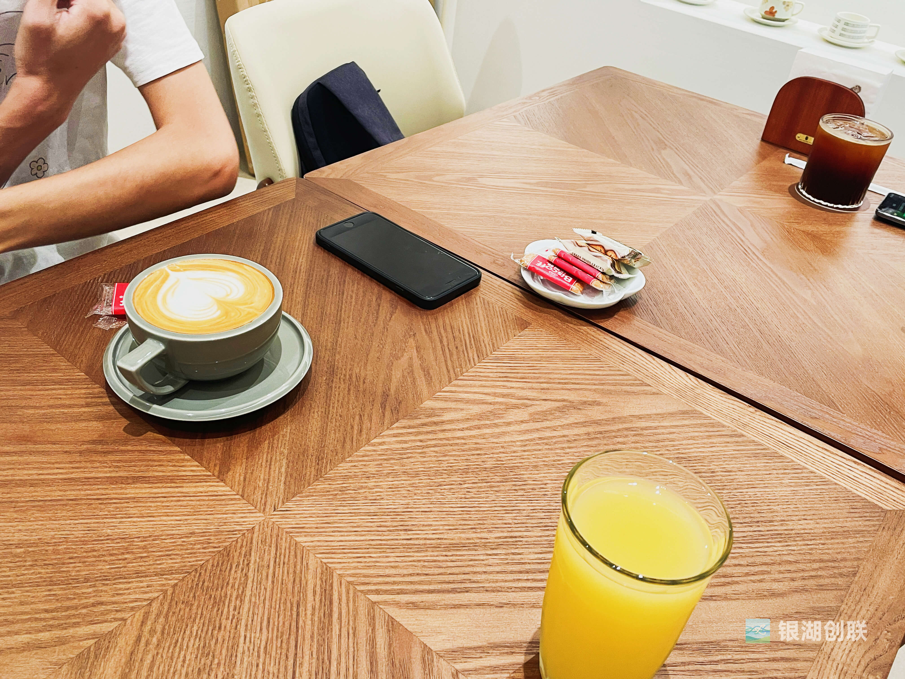
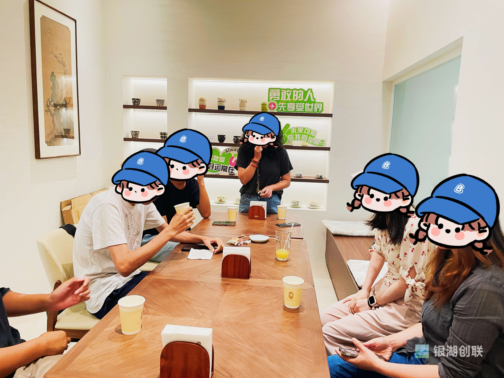
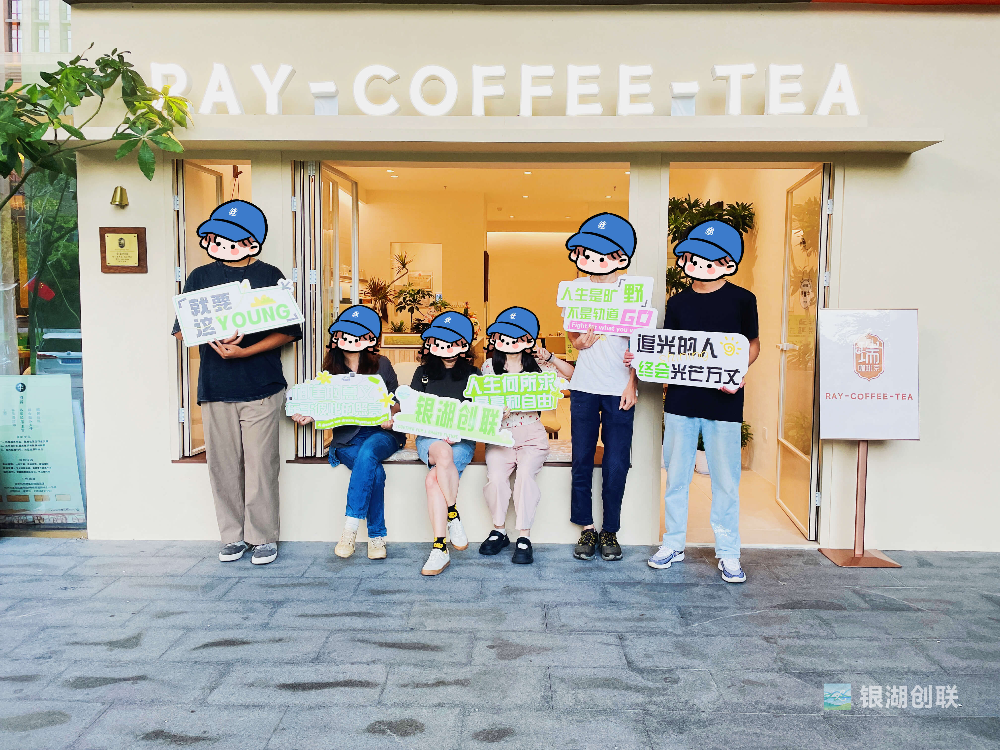

10 月 1 日下午，银湖创联第四次「非确定唠嗑儿」在瑞咖啡悄然进行。

6 个人，3 小时，一场没有议程的交谈，却意外地成为了近期最治愈的时光。

**坦诚与困境**

活动开始时，只有我、姜姜和 YZ 三人。

我们聊起了近期组织活动遇到的困境——国庆期间的两个活动响应都不太理想。

我坦言，这种缺乏正反馈的状态确实让人感到挫败。

「如果心力不够强，可能就会考虑放弃。」

当我说出这句话时，反而觉得轻松了许多。

令人感动的是，YZ 立即回应：「我不是会来参加的嘛！」

这句话，在那一刻显得格外有分量。

**新面孔与新视角**

就在我们深入交流时，W、MY 和瑞咖啡的 M 陆续加入，让谈话走向了意想不到的方向。

M——瑞咖啡的「少东家」，学的是动物科学，热爱钓鱼。

但他的钓鱼方式完全颠覆了我的认知：不是静坐等待，而是主动寻找鱼群，像极了猎手。

更让人惊讶的是，这位后生阅读的书籍深度，让我这不太看书的人自愧不如。

**从亲子教育到人生哲学**

随着 MY 的加入，话题自然地转向亲子关系。

YZ 分享了她与女儿的相处之道，关于该给孩子多少自由度的讨论，引发了在场每个人的思考。

有趣的是，没有孩子的我们几个，并没有感到隔阂，反而在这些真实的育儿故事中，看到了不同生活阶段的智慧。

有时，倾听本身就是一种参与。

**海钓故事与人生感悟**

临近结束时，M 和 MY 聊起了海钓经历。

YZ 也加入讨论，分享了她和女儿坐船出游的趣事。

那一刻，咖啡香气氤氲，故事在室内流转，每个人都沉浸在他人的人生片段中。

**反思与感谢**

这次活动偏离了预设的「正题」，却意外地实现了社区创建的初心——增进人与人之间的真实连接。

特别要感谢瑞咖啡的老板，为了我们的活动特意调整了排班。

这份支持，让这个小小的社区又多了一份温暖。

做社区很难，特别是在缺乏即时正反馈的时候。

但这次 6 个人的聊天让我明白：重要的不是规模，而是每一次真诚交流带来的微光。

这些微光汇聚起来，就足以照亮前行的路。

银湖创联还会继续，因为还有故事要听，还有人要遇见，还有连接在发生。

---

银湖创联｜让创造者不再孤独
期待在下一场活动，与你相遇
