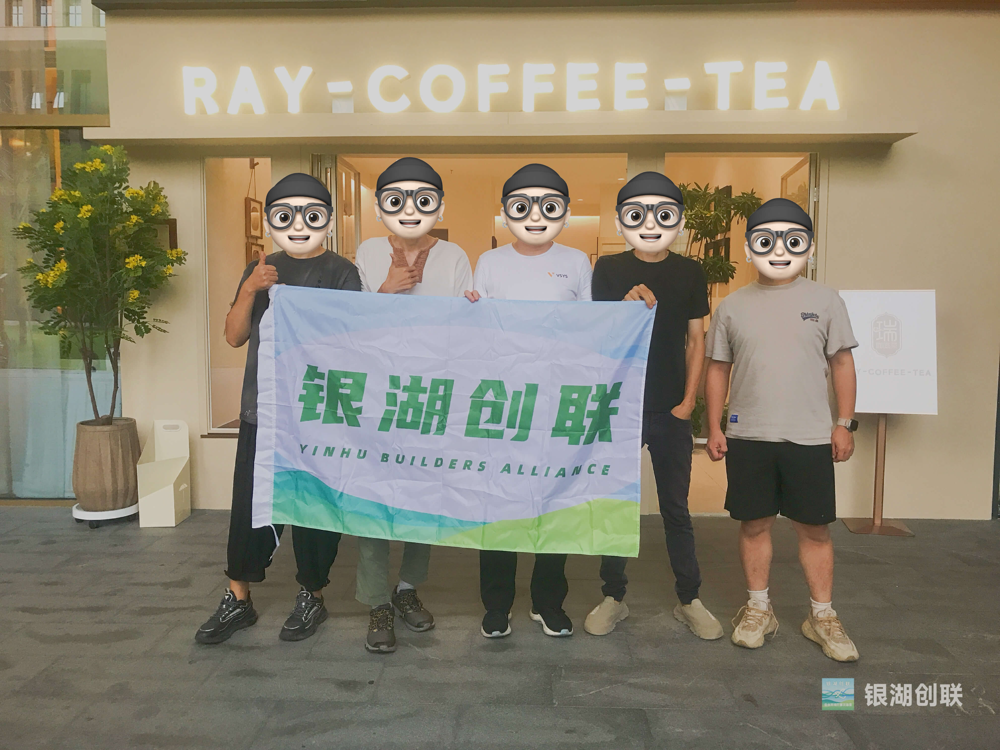

10 月的银湖，空气中开始泛起秋意，而我们的第五场「非确定唠嗑儿」却热度不减。

先后 7 人到场，还有专程从良渚赶来的！

这场原打算讨论自由职业盈利模式的聚会，意外地变成了关于「如何激活银湖青年活力」的精彩探讨。

**议题转向：从个人发展到区域活力**

由于现场新人占比较高，这次的自我介绍环节回归到传统的大家轮番上。

因原议题提出者临时有事未到场，我们转而围绕一位可与政府部门连接的青年代表带来的现实议题展开。

主题正是「如何支持本地青年活力提升」——这恰好与我们创建银湖创联的初心不谋而合。

「我希望在银湖能看到更多扶持 AI 创造者等个人、小微创新团体的空间和政策。」我首先提出建议，「比如可以提供用于黑客松、路演等活动的灵活场地，参考余杭、良渚地区的友好政策。」

这个话题立即引发了大家的共鸣。

其他伙伴补充道，目前银湖存在人才与资源信息流通不畅的问题——有些本地工作室在本地反而难以找到，需要通过 BAC、天目里等场所才能接触到。

这恰恰印证了我们推动银湖创联、构建本地生活服务平台的必要性。

**科技当以人为本**

从良渚专程赶来的小伙伴是个 AI 创业者。

他关注的个人数智化方向，与我设想的「个人与家庭数智生活场景」高度契合。

我们初步交流了该如何用科技解决人的生活、社会问题，而非制造问题，尤其是当下很多人关注的 AI 对人类劳工造成的冲击。

不管科技怎样发展，人们对幸福美好生活的向往、对有效社交活动的需要是不变的，科技应当赋能这些。

这也再次说明，无论是通过线下活动建立并增强连接，还是建设本地生活服务平台，都很具有现实意义。

**结语**

第五场唠嗑让我们更加确信：银湖需要更多这样的连接。

从 AI 创新空间的设想到本地信息平台的构想，从政策建议到个人数智化生活的探索，每一个想法都在为银湖的年轻人描绘更丰富的可能性。

或许下次，那个改变银湖的点子，就来自你的发言。

---

银湖创联｜让创造者不再孤独
📌 点击关注，获取下期活动资讯
